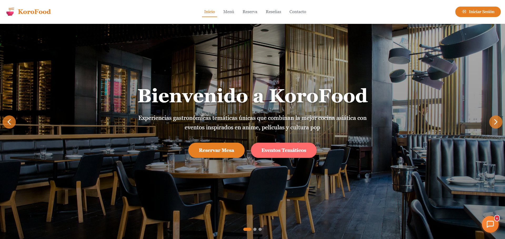

# 🚀 KoroFood's Restaurant

## 📸 Demo

<div align="center">
    
</div>

## 📖 Description

A reservation management system for restaurants, event organizers, and anime fans; the system is real-time, optimizing time.


## ✨ Characteristics
<ul>
  <li>📅 24/7 digital bookings for regular and special service</li>
  <li>🔒 Reservation validation using QR codes</li>
  <li>🛎️ Real-time order management between waiter/customer</li>
  <li>🤖 AI ChatBot for automated customer support</li>
  <li>⭐ Dish or event rating system</li>
  <li>📊 Administrative Dashboard with CRUD operations</li>
  <li>📈 Panel of graphs with real-time data</li>
</ul>

## 🛠️ Technologies

Back-End
| Technology| Use |
|----------|:---------------:|
| **SpringBoot** | Main framework for microservices|
| **RabbitMq** | Asynchronous messaging between microservices |
| **PostgreSQL** | Main database |
| **MongoDB** | Database for recording messages |
| **Redis** | High performance cache |
| **JWT + OAUTH 2.O** | Authentication and authorization |
</br>

Front-End
| Technology| Use |
|----------|:---------------:|
| **Angular** | User interface framework|
| **TypeScript** | Main language of the framework |
| **WebSockets** | Real-time communication |
</br>

Infrastructure 

| Technology| Use |
|----------|:---------------:|
| **Render** | Backend and database deployment |
| **Vercel** | Frontend deployment |
| **Docker** | Containers for microservices |
| **Kubernetes** | Orchestrator for containers |
| **Cloudinary** | Image management |
</br>

## 🏗️ Architecture
The korofoods system is built on a microservices architecture where each microservice/module is independent, making it resilient to change and scalable. Communication is handled via RabbitMQ and WebSocket.

MicroServices
| Service | Port | Description |
|----------|:------:|:-----------:|
| **user-service** | 8081:8081 | Main service where you call the other services |
| **table-service**| 8082:8082 |  Table management service  | 
| **reservation-service** | 8083:8083 | Service for registering reservations and inquiries |
| **qualification-service**| 8084:8084 | Service for recording grades |
| **payment-service** | 8085:8085  | Service for processing payments on orders or reservations |
| **order-service** | 8086:8086  | Service for order management, registration, and queries |
| **menu-service**| 8087:8087 |  Service to obtain the restaurant's menu | 
| **event-service** | 8088:8088 |  Service to obtain all available events at the restaurant    | 
| **api-gateway** | 8098:8098 |  Single entry point for all client requests, handles routing  | 
| **eureka-server** | 8761:8761 | A service registry that allows microservices to discover and communicate with each other.   | 
| **postgres** | 5433:5432 |  Main relational database for transactional data  | 
| **mongodb** | 27017:27017 |  NoSQL database for storing chat messages and their logs  | 
| **redis** | 6379:6379 |  High-performance cache for sessions, tokens, and frequently queried data  | 
| **rabbitmq** | 5672:5672 |  Asynchronous message broker for event-based communication between microservices  |


## 🔧 Installation
1. Clone the repository
```bash
bash

git clone https://github.com/CoDeVeck/KoroFood-s.git
cd Korofoods
```

2. Configure environment variables
```bash
bash

# Create your .env file and put it in the project root
cp backend/.env
```

```env
env

JWT_SECRET=tu_jwt_secret
CLOUDINARY_NAME= cloudinary_name
CLOUDINARY_KEY= cloudinary_key
CLOUDINARY_SECRET= cloudinary_secret
GEMINI_API_KEY= gemini_api_key
GOOGLE_VISION_API_KEY= google_vision_api_key
TWILIO_ACCOUNT_SID= twilio_account
TWILIO_AUTH_TOKEN= twilio_auth_token
TWILIO_PHONE_NUMBER= twilio_phone_number
```

3. Launch with Docker Compose
```bash

bash
docker-compose up -d
```

4. Instalar dependencias del frontend
```bash
bash

cd frontend
npm install
ng serve --ssl true
```
The app will be available in http://localhost:4200 
</br>

## 👥 Contributors 
<a href="https://github.com/CoDeVeck/KoroFood-s/graphs/contributors"> 
  
</a>

## 📄 License
This project is licensed under the [MIT License](./LICENSE).

